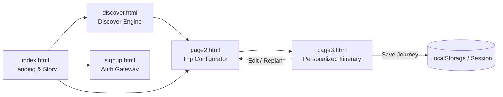

# 🌍 Dastaan | Crafting Your Travel Story
> **Stories &bull; Ideas &bull; Emotions** &mdash; A cinematic, editorial travel planning platform that unifies discovery, intelligent budgeting, and personalized day-by-day itineraries into a single cohesive story.

---

## 📖 Table of Contents
- [Overview](#-overview)
- [The Problem We Solve](#-the-problem-we-solve)
- [Key Features & User Journey](#-key-features--user-journey)
  - [1. Cinematic Landing Experience](#1-cinematic-landing-experience-indexhtml)
  - [2. Intelligent Destination Discovery](#2-intelligent-destination-discovery-discover)
  - [3. Interactive Trip Configurator](#3-interactive-trip-configurator-page2)
  - [4. Dynamic Travel Journal & Itinerary](#4-dynamic-travel-journal--itinerary-page3)
  - [5. Authentication & Profile Management](#5-authentication--profile-management-signuphtml)
  - [6. Unified Responsive Navigation](#6-unified-responsive-navigation)
- [Design System & Aesthetics](#-design-system--aesthetics)
- [Recommendation & Scoring Algorithm](#-recommendation--scoring-algorithm)
- [Technical Architecture & Stack](#-technical-architecture--stack)
- [Directory Structure](#-directory-structure)
- [Data Flow & Storage Schema](#-data-flow--storage-schema)
- [Getting Started & Local Development](#-getting-started--local-development)
- [Roadmap & Future Phases](#-roadmap--future-phases)

---

## 🧭 Overview

**Dastaan** (*Urdu/Persian for "Tales" or "Epics"*) is a modern web application engineered to transform chaotic travel planning into an immersive, editorial storytelling journey. Instead of forcing travelers to juggle dozens of open tabs (maps, booking sites, blogs, budget spreadsheets, and itineraries), Dastaan streamlines the entire travel lifecycle into a personalized narrative tailored to the traveler's budget, timeframe, preferred pace, and personal interests.

---

## 🎯 The Problem We Solve

Traditional travel planning is fragmented:
* 🗺️ **Maps** for checking geographic proximity and routes
* 📝 **Blogs & Social Media** for curated recommendations
* 🏨 **Booking Engines** for accommodation options
* 📊 **Spreadsheets** for budget tracking and estimation
* 🗂️ **Notes Apps** for daily schedules and checklists

**Dastaan unifies this journey into a 3-step paradigm:**
1. **01 &mdash; Tell Us**: Input your destination, duration, budget, pace, and interests.
2. **02 &mdash; We Plan**: Dastaan computes route-optimized timelines, cost breakdowns, and activity sequences.
3. **03 &mdash; You Travel**: Receive a day-by-day travel journal with interactive photo previews and smart replanning capabilities.

---

## ✨ Key Features & User Journey



### 1. Cinematic Landing Experience (`index.html`)
* **Scroll-Linked Parallax Storytelling**: Physics-based smooth scrolling (`smoothstep`, `lerp`, and `requestAnimationFrame`) that reveals layered architectural elements, split-frame landscapes, and background scenes.
* **Dynamic Inverted Arch Water-Cards**: Interactive chapter cards that emerge along a curved trigonometric path (`cos`/`sin` trajectory) with 3D tilts and smooth reading crawl zones.
* **Editorial Problem & Solution Showcase**: Interactive comparison demonstrating how Dastaan aggregates fragmented travel planning tools.
* **Live Replanning Simulation**: Demonstrates instantaneous adaptation when constraints change (e.g., automatically adjusting activities and accommodation to lower total costs from ₹30,000 to ₹19,600).

### 2. Intelligent Destination Discovery (`discover/`)
* **Sticky Chapter Flow**: 4-step progressive questionnaire:
  * `01 TIME` &mdash; Choose duration (Weekend 2–3 days, 4–6 days, 6–7 days, or 8+ days).
  * `02 BUDGET` &mdash; Select budget tiers (Under ₹10K, ₹10K–₹20K, ₹20K–₹40K, ₹40K+) or enter a custom numeric amount.
  * `03 EXPERIENCE` &mdash; Multi-select interests (*Food, Nature, Culture, History, Adventure, Shopping, Art, Nightlife*).
  * `04 PACE` &mdash; Choose travel rhythm (*Relaxed, Balanced, Packed*).
* **Scroll-Linked Progress Tracking**: Visual fill-bar and chapter highlighting driven by `IntersectionObserver`.
* **Live Travel Profile Summary**: Real-time review of selected criteria before running recommendations.
* **Cinematic Search Transition**: Smooth animated loader providing progressive feedback ("Understanding your journey...", "Finding places that fit...").
* **Asymmetric Editorial Results**: Top recommendations rendered with custom match percentages (*Great Fit, Strong Fit, Good Fit*), "Why it fits" rationales, and sorting tools (*Best Match, Lowest Budget, Shortest Trip*).
* **One-Click Hand-Off**: Direct transfer of discovered destination preferences to the itinerary builder.

### 3. Interactive Trip Configurator (`page2/page2.html`)
* **Interactive Destination Selector**: Instant search bar and quick-select destination chips (*New Delhi, Jaipur, Manali, Kyoto, Mostar, Florence, Istanbul*).
* **Live Visual Feedback**: Crossfading backdrop imagery that changes dynamically based on the selected destination.
* **Custom Step Controls**: Fine-grained duration stepper (+/- buttons and quick presets) and numeric budget input with instant preset chips.
* **Interest Matrix**: Multi-selectable visual tiles with live counters.
* **Pace & Rhythm Selection**:
  * **Relaxed** &mdash; 2–3 sights/day (*"Slow mornings, fewer stops"*)
  * **Balanced** &mdash; 3–4 sights/day (*"See the best without rushing"*)
  * **Packed** &mdash; 5+ sights/day (*"Make every moment count"*)
* **Live Summary & Validation**: Constant real-time summary card validating user constraints before generating the itinerary.

### 4. Dynamic Travel Journal & Itinerary (`page3/page3.html`)
* **Cinematic Hero Header**: 80vh full-bleed destination imagery with customized taglines dynamically composed from user interests.
* **"Trip at a Glance" Editorial Bar**: Quick breakdown of duration, budget, active interest count, and pace style.
* **Day-by-Day Journal & Timeline**: Sticky day tabs that update alternating editorial cards (*image-left / image-right*) with scheduled times, categorized tags, and rich descriptions.
* **Full-Screen Lightbox Modal**: High-resolution image inspection with place details and category badges upon clicking any activity card.
* **Intelligent Route Sequencing & SVG Canvas**: Visualized topological path diagram showing travel sequence, estimated movement in kilometers, and calculated time saved.
* **Transparent Budget Allocation**: Segmented interactive progress bar with hover tooltips and categorical expense breakdowns (*Accommodation 40%, Food 25%, Transport 15%, Activities 15%, Buffer 5%*).
* **"Built Around You" Personalization Panels**: Dynamic explanation cards describing exactly how each chosen interest shaped the final itinerary.
* **Action Toolbar**:
  * `Save My Journey` &mdash; Persists trip state with feedback toast banner.
  * `Edit Preferences` &mdash; Returns to configurator preserving existing inputs.
  * `Start Over` &mdash; Clears stored itinerary state and resets the flow.

### 5. Authentication & Profile Management (`signup.html`)
* **Editorial Split Layout**: Curated photography collage on the left and interactive auth forms on the right.
* **Animated Curtain Transition**: Seamless animated transition between Login and Sign Up views.
* **Client-Side Security**: Web Crypto API password hashing (`SHA-256`) with show/hide password toggles.
* **Persistent Sessions**: User profile storage and session preservation via `localStorage` (`dastaan_users`) and `sessionStorage` (`dastaan_session`).

### 6. Unified Responsive Navigation (`css/navigation.css` & `js/navigation.js`)
* **Glassmorphic Fixed Header**: Blur-backed navigation bar that adapts across all pages.
* **Animated Active Indicator**: Subtle gold indicator dot anchored to the active page.
* **Mobile Hamburger Navigation**: Touch-friendly slide-down drawer with outside-click dismissal.
* **Unified Editorial Footer**: Multi-column navigational links, brand statement, and social links.

---

## 🎨 Design System & Aesthetics

Dastaan utilizes a bespoke luxury editorial design language inspired by print travel journals and high-end publications.

### Color Palette
| Token | Hex Value | Role / Usage |
| :--- | :--- | :--- |
| **`--primary`** | `#173B35` | Deep Forest Green (Heritage backgrounds, primary brand tone) |
| **`--gold`** | `#DFBA73` / `#D6B56D` | Royal Gold Accent (Buttons, active states, key highlights) |
| **`--paper`** | `#E8DCC7` / `#F4EFE3` | Warm Ivory Paper (Cards, light sections, typography) |
| **`--bg-light`** | `#F7F5EF` | Editorial Light Background (Questionnaires, text sections) |
| **`--ink`** | `#1D2421` | Deep Charcoal Ink (Body copy, high-contrast headings) |
| **`--accent`** | `#C96B4B` / `#C87955` | Terracotta / Clay Accent (Tags, route indicators, subtle warnings) |

### Typography
* **Display / Editorial**: `Ogg Medium` & `Cormorant Garamond` (Serif &mdash; titles, headers, pull-quotes).
* **Interface / Body**: `Inter` / `Satoshi` (Clean modern sans-serif &mdash; inputs, labels, metadata, body text).

---

## 🧠 Recommendation & Scoring Algorithm

The Discover engine ranks destinations dynamically against user constraints using a weighted scoring matrix ($S \in [10, 100]$):

$$\text{Total Score} = S_{\text{budget}} + S_{\text{duration}} + S_{\text{interests}} + S_{\text{pace}}$$

| Criterion | Max Weight | Evaluation Logic |
| :--- | :---: | :--- |
| **Budget Fit** | **30%** | **30 pts** if destination budget $\le$ user choice; **15 pts** if within $+25\%$ buffer; **5 pts** otherwise. |
| **Duration Fit** | **25%** | **25 pts** if within preferred day range; **12 pts** if off by $\pm 1$ day; **0 pts** otherwise. |
| **Interests Match** | **30%** | $\text{Score} = \left(\frac{\text{Matching Interests}}{\text{Total Selected Interests}}\right) \times 30\text{ pts}$. |
| **Pace Fit** | **15%** | **15 pts** if destination supports selected travel style; **5 pts** fallback. |

---

## 🛠️ Technical Architecture & Stack

* **Markup & Structure**: Semantic HTML5 (`<main>`, `<section>`, `<header>`, `<nav>`, `<aside>`, `<footer>`, `<article>`).
* **Styling**: Modern CSS3 (CSS Custom Properties / Variables, Flexbox, CSS Grid, `backdrop-filter`, `@keyframes`, clamp responsive scaling).
* **Scripting**: Pure Vanilla JavaScript (ES6+ Modules, `IntersectionObserver`, `requestAnimationFrame`, Web Crypto API for hashing).
* **Vector Graphics**: Dynamic inline SVG route calculation and procedural curve rendering.
* **Storage & Persistence**: `localStorage` and `sessionStorage` for zero-backend client-side state preservation.

---

## 📁 Directory Structure

```text
Dastaan-Phase-1/
├── css/
│   ├── navigation.css        # Unified glassmorphic navbar and footer styles
│   ├── signup.css            # Split-screen auth styling & curtain animations
│   └── styles.css            # Landing page parallax styles & design tokens
├── discover/
│   ├── discover.css          # Discovery questionnaire and magazine grid styling
│   ├── discover.html         # Interactive destination finder & chapter builder
│   └── discover.js           # Discover state sync, matching algorithm & filtering
├── images/
│   ├── image1.jpg ... 4.jpg  # Global editorial destination visuals
│   ├── logo.png              # Official Dastaan brand emblem
│   ├── jaipur/               # High-res photography of Jaipur landmarks
│   ├── manali/               # High-res photography of Manali treks & valleys
│   └── newdelhi/             # High-res photography of Delhi monuments & art
├── js/
│   ├── auth.js               # Client-side auth, SHA-256 hashing & validation
│   ├── navigation.js         # Mobile drawer menu & navigation behavior
│   └── script.js             # Landing page scroll engine & arch card trajectory
├── page2/
│   ├── page2.css             # Trip configurator & stepper styling
│   ├── page2.html            # Step 01: Destination, days, budget & pace builder
│   └── page2.js              # Live trip state manager & input validation
├── page3/
│   ├── page3.css             # Travel journal, timeline & route SVG styling
│   ├── page3.html            # Step 02 & 03: Personalized day-by-day itinerary
│   └── page3.js              # Itinerary generator, SVG route engine & lightbox
├── index.html                # Main landing page & cinematic scroll story
├── signup.html               # User login and registration portal
└── README.md                 # Complete project documentation
```

---

## 💾 Data Flow & Storage Schema

Dastaan preserves state across pages using `localStorage` keys:

### 1. `dastaanTrip` (Active Trip Configuration)
```json
{
  "destination": {
    "id": "jaipur",
    "name": "Jaipur",
    "country": "India",
    "image": "../images/jaipur/amerfortandasheeshmahal.jpg",
    "defaultDur": 3,
    "defaultBud": 10000
  },
  "duration": 3,
  "budget": 10000,
  "interests": ["History", "Culture", "Shopping"],
  "travelStyle": "Balanced"
}
```

### 2. `dastaanSaved` & `dastaanSavedJourney`
* `dastaanSaved`: Array of saved destination IDs from the Discover page (`["kyoto", "jaipur"]`).
* `dastaanSavedJourney`: Complete itinerary object saved from Page 3.

### 3. `dastaan_users` & `dastaan_session`
* `dastaan_users`: Registered user records with SHA-256 hashed passwords and preferred travel styles.
* `dastaan_session`: Active session token containing user identifier and login timestamp.

---

## 🚀 Getting Started & Local Development

Because Dastaan is built with pure web standards (HTML5/CSS3/Vanilla JS), no heavy build tools, transpilers, or node packages are required to run Phase 1.

### Prerequisites
* Any modern web browser (Google Chrome, Mozilla Firefox, Safari, Microsoft Edge).
* A local static web server (to avoid browser CORS restrictions on local asset loading).

### Option 1: VS Code Live Server (Recommended)
1. Open the `Dastaan-Phase-1` directory in VS Code.
2. Install the **Live Server** extension.
3. Right-click `index.html` and select **"Open with Live Server"**.

### Option 2: Python Built-in HTTP Server
Run the following command from the root directory:
```bash
# Python 3
python -m http.server 8000
```
Then navigate to `http://localhost:8000` in your web browser.

### Option 3: Node.js `serve` / `http-server`
```bash
npx serve .
```

---

## 🗺️ Roadmap & Future Phases

- [x] **Phase 1: Cinematic Planning Engine (Current)**
  - Cinematic scroll landing experience
  - Multi-attribute discovery matching algorithm
  - Interactive trip configurator and preference builder
  - Dynamic day-by-day travel journal with route visualizations and lightbox
  - Client-side auth and persistent state management
- [ ] **Phase 2: Live APIs & Interactive Geospatial Maps**
  - Mapbox / Leaflet live GIS map integration for real-time routing
  - Weather forecast integrations and season-aware recommendations
  - Live currency conversion and budget exchange rates
- [ ] **Phase 3: Backend, Bookings & Collaboration**
  - Cloud database persistence (PostgreSQL / Firebase)
  - Real-time collaborative trip planning (shareable links & multi-user itineraries)
  - Direct integration with booking APIs for stays, transport, and experiences
  - Offline PWA (Progressive Web App) itinerary export to PDF / Apple Wallet

---

<div align="center">
  <sub>Crafted with passion for authentic travel experiences &bull; &copy; 2026 Dastaan. All rights reserved.</sub>
</div>
